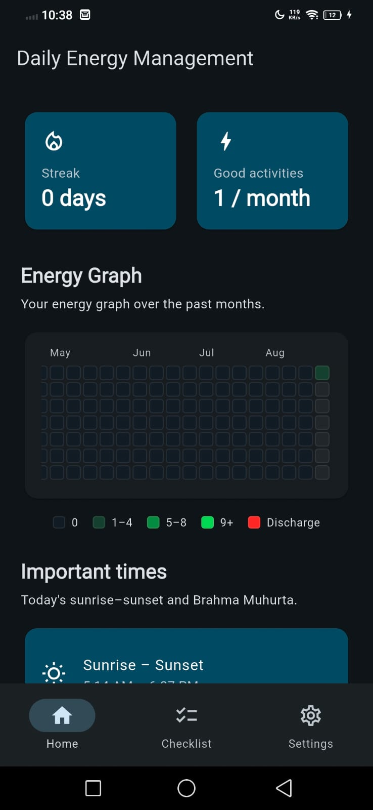
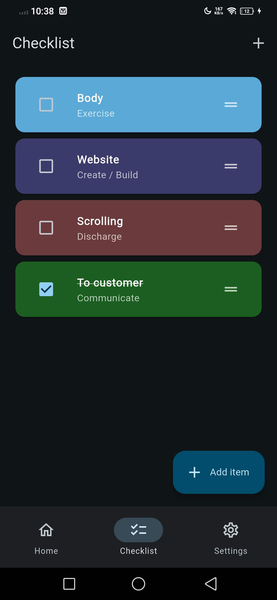
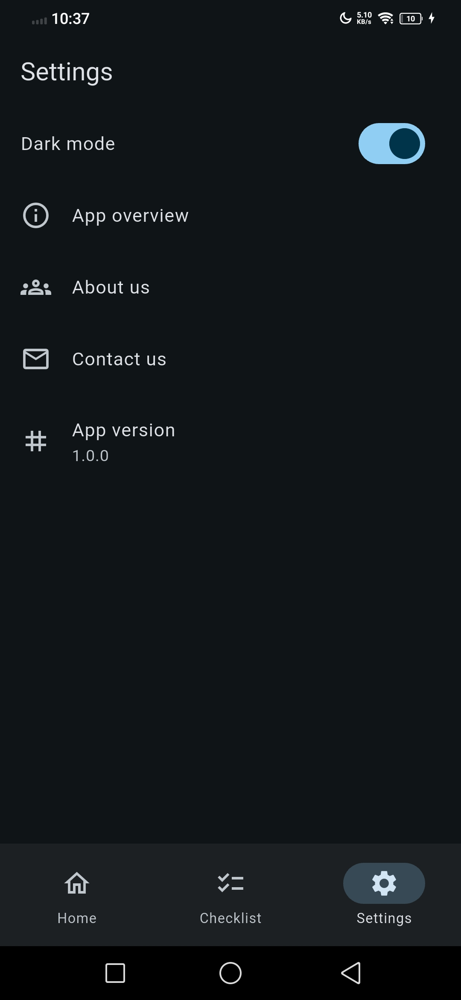

# Daily Energy Management

Track daily charging and discharging activities, build streaks, stay aware of your energy patterns and build unstoppable momentum.

Some people may find it too simple and generic, unless they know how to use it. So I have labelled it as, this app is not for everyone.
>[!NOTE]
> “This app is for those who view life in terms of energy, vibration and frequencies.”

My mission is simple: to build 'The' one app that can change your entire life, from academics, work, research, finance, business venture, skills, communication, and relationships. This app is different from to-do list, time tracker, routine or time table apps.

> [!TIP]
> You need to be aware of just 4 kinds of energies to succed in almost all spheres in life i.e. Exercise energy(know what, when, how to exercise), Creation/building energy(know what, when, for whom to build), Communication energy(know how when whom to communicate), Discharging energies(Avoid this tamsik energy as much as possible).

The simplicity of this app is the result of my 10+ years of constant thinking, how to organise my life, derive one mater formula to solve all the problem of my life, and at last I came up with some laws that I implemented in this app.

The complete details of how to use this app effectively is not revealed. User is advised to contact me for further guidance if interested. or user can use it as per their common sense. My purpose of keeping it secret: misuse of its power. 

## App overview

**Daily Energy Management** helps you notice how daily choices charge or drain your energy. Check off exercise, create, communicate, and discharge items each day, watch your year-long energy graph fill in, and see important times like sunrise–sunset and Brahma Muhurta.

## Screenshots

| Home | Checklist | Settings |
| :---: | :---: | :---: |
|  |  |  |

## Features

- **Home** — streak, monthly good activities, energy graph, important times
- **Checklist** — add, edit, delete, reorder, and check off daily items
- **Energy graph** — GitHub-style year view (green for charging, red for discharge)
- **Important times** — today’s sunrise–sunset and Brahma Muhurta
- **Settings** — dark/light theme, app overview, about, contact
- **Local storage** — on device; no account required


### Download the app or build it yourself

Download the already built app from the [`final_app`](final_app/) folder. (This is not a virus or malicious code — you can safely download it, I guarantee.)

Or build from scratch

1. Install [Flutter](https://docs.flutter.dev/get-started/install)
2. Clone this repo and open the project folder
3. Get dependencies and run:

```bash
flutter pub get
flutter run
```


### Build a release APK (Android)

```bash
flutter build apk --release
```

The APK is at `build/app/outputs/flutter-apk/app-release.apk`. Install it on your phone, allow location if you want local sunrise times, then use **Checklist** to track the day and **Home** to review your graph.

### First launch

1. Read the app overview, then tap **Get started**
2. Check items on **Checklist** as you complete them
3. Open **Home** to see streak, energy graph, and important times
4. Use **Settings** for theme, about, and contact


## Contact for more details

Email: [manish21295@yahoo.com](mailto:manish21295@yahoo.com)

Or open **Settings → Contact us** in the app.

## Contribute

Pull requests and issues are welcome.

1. Fork the repository
2. Create a branch (`git checkout -b feature/your-idea`)
3. Commit your changes
4. Open a pull request with a short description

Please keep changes focused and match the existing code style.

## License

This project is licensed under the [Apache License 2.0](LICENSE).


