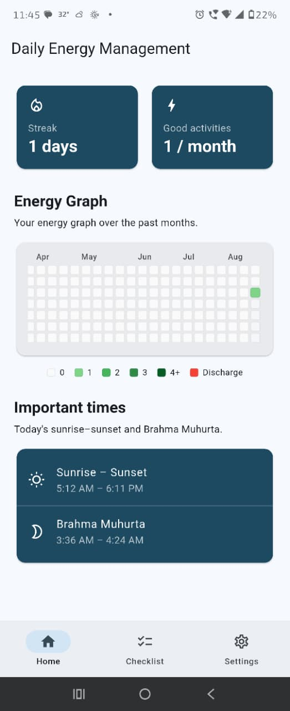
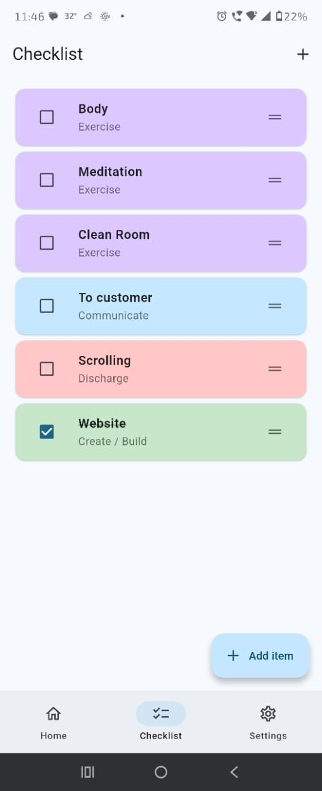
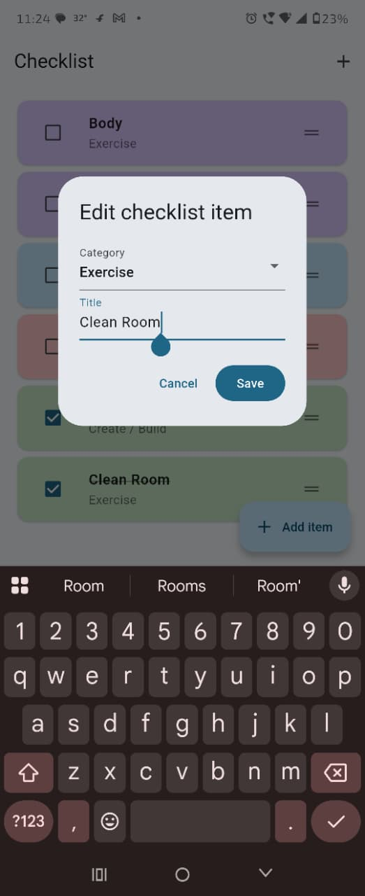
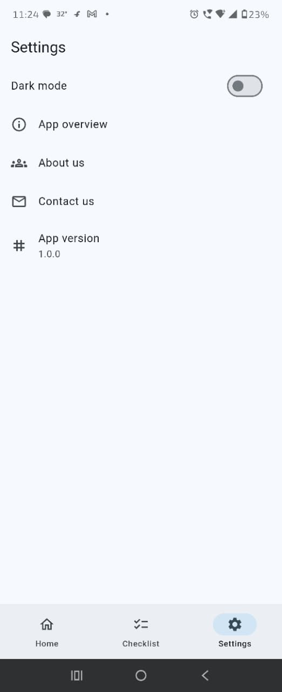

# Daily Energy Management

Track daily charging and discharging activities, build streaks, and stay aware of your energy patterns.

## App overview

**Daily Energy Management** helps you notice how daily choices charge or drain your energy. Check off exercise, create, communicate, and discharge items each day, watch your year-long energy graph fill in, and see important times like sunrise–sunset and Brahma Muhurta.

## Screenshots

<table>
  <tr>
    <th>Home</th>
    <th>Checklist</th>
    <th>Edit List</th>
    <th>Settings</th>
  </tr>
  <tr>
    <td></td>
    <td></td>
    <td></td>
    <td></td>
  </tr>
</table>

## Features

- **Home** — streak, monthly good activities, energy graph, important times
- **Checklist** — add, edit, delete, reorder, and check off daily items
- **Energy graph** — GitHub-style year view (green for charging, red for discharge)
- **Important times** — today’s sunrise–sunset and Brahma Muhurta
- **Settings** — dark/light theme, app overview, about, contact
- **Local storage** — SQLite on device; no account required

## How to download and use

### Run from source

1. Install [Flutter](https://docs.flutter.dev/get-started/install)
2. Clone this repo and open the project folder
3. Get dependencies and run:

```bash
flutter pub get
flutter run
```

### Build a release APK (Android)

```bash
flutter build apk --release
```

The APK is at `build/app/outputs/flutter-apk/app-release.apk`. Install it on your phone, allow location if you want local sunrise times, then use **Checklist** to track the day and **Home** to review your graph.

### First launch

1. Read the app overview, then tap **Get started**
2. Check items on **Checklist** as you complete them
3. Open **Home** to see streak, energy graph, and important times
4. Use **Settings** for theme, about, and contact

## Contact

Email: [manish21295@yahoo.com](mailto:manish21295@yahoo.com)

Or open **Settings → Contact us** in the app.

## Contribute

Pull requests and issues are welcome.

1. Fork the repository
2. Create a branch (`git checkout -b feature/your-idea`)
3. Commit your changes
4. Open a pull request with a short description

Please keep changes focused and match the existing code style.

## License

This project is licensed under the [Apache License 2.0](LICENSE).
